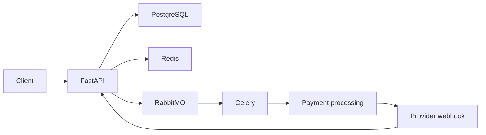

# PayFlow

PayFlow is a small event-driven payment and order processing backend built to demonstrate production-oriented Python backend patterns.

## Overview

The MVP provides JWT authentication, order management, asynchronous payment processing, Redis-backed idempotency/caching/rate limiting, signed provider webhooks, PostgreSQL persistence, RabbitMQ/Celery messaging, and automated tests.

## My Contribution

Built and developed this project with AI-assisted coding, while taking responsibility for the project requirements, architecture, implementation decisions, debugging, testing, and final review.

Key contributions:

- Defined the backend requirements and overall event-driven architecture.
- Designed the layered structure using FastAPI routes, services, repositories, and SQLAlchemy.
- Directed the implementation of authentication, order management, payment processing, and webhook workflows.
- Reviewed and refined payment idempotency, concurrency handling, state transitions, and transactional behavior.
- Worked through implementation and integration issues, including async SQLAlchemy behavior, Redis failure handling, and test failures.
- Designed the Redis usage for idempotency, caching, and rate limiting while keeping PostgreSQL as the source of truth.
- Reviewed the Celery/RabbitMQ background-processing flow and retry behavior.
- Validated webhook security using HMAC signatures, timestamp checks, and PostgreSQL-backed event idempotency.
- Reviewed and improved the automated test suite, including integration and concurrency-related tests.
- Reviewed the Docker/Docker Compose setup and environment configuration for the complete application stack.
- Performed the final code review and kept the MVP intentionally small and understandable.

## Architecture



PostgreSQL is the source of truth. Redis contains only ephemeral control/cache data; RabbitMQ is the Celery broker.

## Tech Stack

- Python 3.12+
- FastAPI
- PostgreSQL
- SQLAlchemy 2.x
- Redis
- RabbitMQ
- Celery
- Docker / Docker Compose
- Pytest

## Key Features

- RESTful APIs
- JWT authentication with Argon2 password hashing
- PostgreSQL persistence with SQLAlchemy ORM and Alembic
- Redis cache-aside caching for single-order reads
- Redis payment idempotency and login rate limiting
- RabbitMQ + Celery background payment processing
- HMAC webhook verification and replay-window protection
- Durable webhook idempotency in PostgreSQL
- Transactional payment/order state updates with row locking
- Focused automated tests
- Docker Compose development stack

## Architecture Decisions

- **FastAPI:** concise typed APIs, dependency injection, Pydantic validation, and excellent OpenAPI/Swagger support.
- **PostgreSQL:** durable relational source of truth with transactions, constraints, and row-level locking.
- **Redis:** appropriate for short-lived cache, idempotency records, and rate-limit counters; none of these replace PostgreSQL data.
- **RabbitMQ:** reliable message broker for decoupling HTTP requests from background work.
- **Celery:** simple Python task execution with retries and worker processes.
- **Asynchronous payment processing:** payment/provider work should not block an HTTP request.
- **Webhook idempotency:** providers may retry deliveries; a unique PostgreSQL `event_id` prevents duplicate processing.
- **PostgreSQL as source of truth:** Redis/RabbitMQ can fail or lose transient state without becoming the authority for payment data.

## API Endpoints

| Method | Endpoint | Description |
|---|---|---|
| POST | `/api/v1/auth/register` | Register a user |
| POST | `/api/v1/auth/login` | Login and receive a JWT |
| GET | `/api/v1/users/me` | Get current user |
| POST | `/api/v1/orders` | Create an order |
| GET | `/api/v1/orders` | List current user's orders |
| GET | `/api/v1/orders/{order_id}` | Get one owned order |
| POST | `/api/v1/orders/{order_id}/cancel` | Cancel a pending order |
| POST | `/api/v1/orders/{order_id}/payments` | Initiate payment; supports `Idempotency-Key` |
| GET | `/api/v1/payments/{payment_id}` | Get an owned payment |
| POST | `/api/v1/webhooks/payment` | Receive signed payment-provider events |
| GET | `/health` | Health endpoint |

## Payment Flow

```text
Client
  -> FastAPI
  -> PostgreSQL (create pending payment)
  -> RabbitMQ
  -> Celery worker
  -> simulated payment processing
  -> payment/order PostgreSQL transaction
```

Payment initiation uses an authenticated, user-scoped `Idempotency-Key`. The database also locks the order during payment creation so concurrent requests cannot create multiple active payments for the same order.

## Webhook Flow

1. Provider sends `X-Webhook-ID`, `X-Webhook-Timestamp`, `X-Webhook-Signature`, and JSON payload.
2. FastAPI verifies HMAC-SHA256 over `webhook_id.timestamp.raw_body` and rejects timestamps older than five minutes.
3. The event is stored in PostgreSQL with a unique `event_id`.
4. Duplicate deliveries are acknowledged without creating another task.
5. New events are published to RabbitMQ for Celery processing.
6. The worker locks the event and payment rows and applies an allowed state transition in one transaction.
7. Supported events are `payment.succeeded`, `payment.failed`, and `payment.refunded`.

## Redis Cache-Aside Pattern

Only `GET /api/v1/orders/{order_id}` is cached for 60 seconds. The endpoint checks Redis first, queries PostgreSQL on a miss, then stores the serialized response. Cache entries are invalidated after order/payment state changes. Redis failures fall back to PostgreSQL.

## Local Setup

### Clone

```bash
git clone <your-repository-url>
cd payflow
```

### Environment variables

```bash
cp .env.example .env
```

On Windows PowerShell:

```powershell
Copy-Item .env.example .env
```

Set strong values for `JWT_SECRET_KEY` and `WEBHOOK_SECRET` before sharing or deploying the application.

### Docker Compose

The recommended recruiter/demo setup is:

```bash
docker compose up --build
```

Then open:

- Swagger: http://localhost:8000/docs
- Health: http://localhost:8000/health
- RabbitMQ management: http://localhost:15672

PostgreSQL, Redis, and RabbitMQ's AMQP port are kept inside the Compose network. PostgreSQL data is persisted in the `postgres_data` volume.

Migrations run automatically when the API container starts. To run them manually inside the API container:

```bash
docker compose exec api alembic upgrade head
```

Stop the stack:

```bash
docker compose down
```

Remove the database volume as well:

```bash
docker compose down -v
```

### Local Python setup

```bash
python -m venv .venv
.venv\Scripts\Activate.ps1
python -m pip install --upgrade pip
pip install -e ".[dev]"
```

Run the API locally after providing PostgreSQL/Redis/RabbitMQ:

```bash
alembic upgrade head
uvicorn app.main:app --reload
```

## Environment Variables

See `.env.example`:

| Variable | Purpose |
|---|---|
| `DATABASE_URL` | Async SQLAlchemy PostgreSQL URL |
| `REDIS_URL` | Redis connection URL |
| `CELERY_BROKER_URL` | RabbitMQ broker URL |
| `CELERY_RESULT_BACKEND` | Redis Celery result backend |
| `JWT_SECRET_KEY` | JWT signing secret |
| `WEBHOOK_SECRET` | Provider webhook HMAC secret |
| `JWT_ALGORITHM` | JWT algorithm; application uses HS256 |
| `ACCESS_TOKEN_EXPIRE_MINUTES` | JWT lifetime |

Never commit `.env` or real secrets.

## Testing

Install development dependencies:

```bash
python -m pip install -e ".[dev]"
```

Run the complete suite:

```bash
python -m pytest -q
```

The tests use an isolated SQLite database where practical and mock/fake Redis or Celery behavior where a real production worker is unnecessary. PostgreSQL-specific locking behavior should additionally be exercised through the Docker stack when making production-level changes.

## Project Structure

```text
payflow/
├── app/
│   ├── api/routes/
│   │   ├── auth.py
│   │   ├── health.py
│   │   ├── orders.py
│   │   ├── payments.py
│   │   ├── users.py
│   │   └── webhooks.py
│   ├── core/
│   │   ├── config.py
│   │   ├── database.py
│   │   ├── exceptions.py
│   │   ├── redis.py
│   │   └── security.py
│   ├── models/
│   ├── repositories/
│   ├── schemas/
│   ├── services/
│   ├── webhooks/
│   ├── workers/
│   └── main.py
├── alembic/
│   └── versions/
├── tests/
│   ├── unit/
│   └── integration/
├── .env.example
├── Dockerfile
├── docker-compose.yml
├── pyproject.toml
└── README.md
```

## Future Improvements

Intentionally outside this MVP: a transactional outbox for guaranteed message publication, real payment-provider integration, refresh tokens, richer authorization, distributed tracing/metrics, PostgreSQL-only concurrency tests in CI, and production deployment orchestration.
